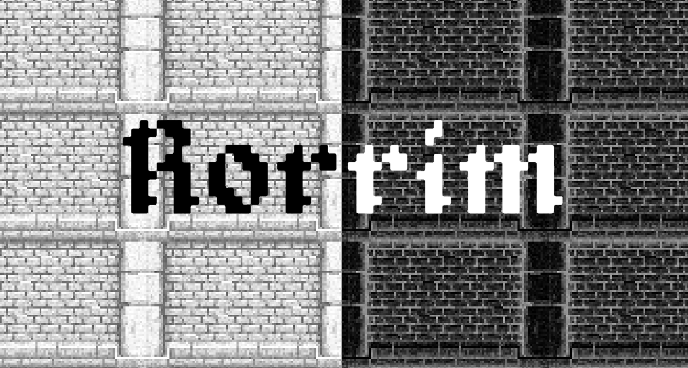

# Rorrim

Video game produced in 48 hours for Global Game Jam 2022, feel free to review our [submission](https://globalgamejam.org/2022/games/rorrim-5)



## Table of Contents

- [How to play](#how-to-play)
- [About](#about)
  - [Global Game Jam](#global-game-jam)
  - [Diversifiers](#diversifiers)
  - [Controls](#controls)
  - [Context](#context)
- [Synopsis](#synopsis)
- [Platforms](#platforms)
- [Built with](#built-with)
- [Getting started](#getting-started)
  - [Prerequisites](#prerequisites)
  - [Installation](#installation)
- [Contributing](#contributing)
- [Credits](#credits)
  - [Jammers](#jammers)
  - [Musics](#musics)
  - [Graphics](#graphics)
- [License](#license)

## How to play

- Open your favorite web browser
- Go to https://marc-gavanier.itch.io/rorrim
- Click on "Run game"
- Enjoy !

## About

### Global Game Jam

- Jam Site: [GGJ Toulouse TGD (Toulouse Game Dev)](https://globalgamejam.org/2022/jam-sites/ggj-toulouse-game-dev)
- Jam year: [2022](https://globalgamejam.org/2022)
- Theme: [duality](https://www.youtube.com/watch?v=-aCKWZQEkCk)

### Diversifiers

- 20th Century Gaming: *Your game's visuals are in the style of games from a device released before the year 2000.*
- Stick Together: *Make a game that revolves around grouping characters or objects.*

### Controls

- Move: `WASD` (English keyboards)
- Move: `ZQSD` (French keyboards)
- Move: `Arrows`
- Switch cameras: `TAB`

### Context

You control two characters: a black skeleton in a white dungeon and a white skeleton in a black dungeon.  
Moves of the white skeleton are mirrored to the black skeleton.

Each of the skeletons must reach an end area in the dungeon to progress to the next level.

You can interact with the elements that have the same color of the skeleton, it can have an impact in the other dungeon!  
You can switch the two views in order to see on the other side of the level.

## Synopsis

Are you alive ? Maybe yes, maybe no...  
You just wake up in the catacombs. How did you come here ?  
Never-mind let's move a little bit...  
Wow!  
What's happening to you?  
You feels... split... or joined ?  
Let's go out of there!  

## Platforms

- Web: [published on itch.io](https://marc-gavanier.itch.io/rorrim)

## Built with

- [Unity 2020.3.26f1](https://unity.com/) is a real-time engine that helps creators to make cross-platform video games

## Getting started

### Prerequisites

- Download and install [Unity](https://unity3d.com/get-unity/download/)

### Installation

1. Clone the repo

```bash
git clone git@github.com:marc-gavanier/rorrim.git
```

2. Open the project with Unity

## Contributing

- Create your Feature Branch (git checkout -b feature/amazing-feature)
- Commit your Changes (git commit -m "add some amazing feature")
- Push to the Branch (git push origin feature/amazing-feature)
- Open a Pull Request

## Credits

### Jammers

- [Marc Gavanier - Programmer](https://www.linkedin.com/in/marc-gavanier/)
- Nicolas Treiber - Programmer

### Musics

- [xdeviruchi, 8-bit-fantasy-adventure-music-pack](https://xdeviruchi.itch.io/8-bit-fantasy-adventure-music-pack)

### Graphics

- [wulax, lpc-skeleton](https://opengameart.org/content/lpc-skeleton)
- [szadiart, rogue-fantasy-catacombs](https://szadiart.itch.io/rogue-fantasy-catacombs)


## License

Released under the terms of the `MIT` license. See [LICENSE](./LICENSE) for the full details.
